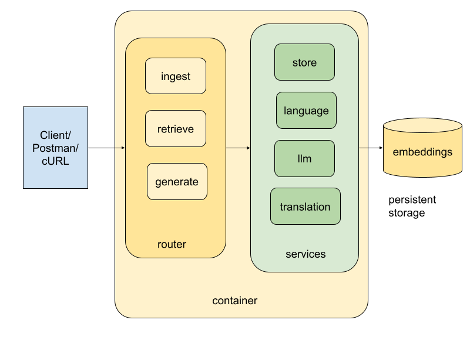

# Acme API

A FastAPI application for ingesting text documents, searching with embeddings, and generating AI-powered answers.

## Architecture



## Repository Structure

```
Acme/
├── app/
│   ├── main.py              # FastAPI application & middleware
│   ├── config.py            # Configuration (env vars + YAML)
│   ├── common/              # Shared utilities & error handling
│   │   ├── errors.py        # Error response utilities
│   │   └── utils.py         # Helper functions (snippet formatting, etc.)
│   ├── routers/             # API endpoints
│   │   ├── ingest.py        # Document ingestion endpoint
│   │   ├── retrieve.py      # Document retrieval endpoint
│   │   └── generate.py      # Answer generation endpoint
│   └── services/            # Core business logic
│       ├── embeddings.py    # Text embedding generation
│       ├── store.py         # FAISS index & document storage
│       ├── language.py      # Language detection
│       ├── llm.py           # LLM answer composition
│       └── translate.py     # Text translation
├── tests/                   # Test suite
├── config.yml               # User-editable prompts & messages
├── requirements.txt         # Python dependencies
└── Dockerfile              # Container configuration
```

## Quick Start

### Setup

1. Install dependencies:
```bash
pip install -r requirements.txt
```

2. Set up your API keys:
```bash
# Client authentication key (for X-API-Key header)
export ACME_API_KEY=your-acme-key-here

# OpenAI API key (for OpenAI service calls)
export OPENAI_API_KEY=your-openai-key-here
```

Or copy `.env.example` to `.env` and fill in your keys:
```bash
cp .env.example .env
# Edit .env with your keys
```

3. (Optional) Customize prompts:
```bash
cp config.yml.example config.yml
# Edit config.yml to customize prompts and messages
```

4. Run the server:
```bash
uvicorn app.main:app --reload
```

Visit `http://localhost:8000/docs` for API documentation.

### Docker

```bash
docker build -t acme-api:latest .
docker run -d \
  --name acme-api \
  -p 8000:8000 \
  -e ACME_API_KEY=your-acme-key-here \
  -e OPENAI_API_KEY=your-openai-key-here \
  -v $(pwd)/app/data:/app/app/data \
  acme-api:latest
```

## API Endpoints

### Authentication

All endpoints except `/health` require `X-API-Key` header with your `ACME_API_KEY` (client authentication key). This is separate from `OPENAI_API_KEY`, which is used internally for OpenAI service calls.

### Ingest Documents

Upload `.txt` files to store them with embeddings:

```bash
curl -X POST http://localhost:8000/ingest \
  -H "X-API-Key: your-acme-key-here" \
  -F "files=@document.txt"
```

**Response:**
```json
{
  "doc_id": "doc_0",
  "language": "en",
  "added": true,
  "index_size": 1
}
```

- Automatically detects language (English or Japanese)
- Creates embeddings and stores in FAISS index
- Deduplicates by content hash

### Retrieve Documents

Search for similar documents:

```bash
curl -X POST http://localhost:8000/retrieve \
  -H "X-API-Key: your-acme-key-here" \
  -H "Content-Type: application/json" \
  -d '{"query": "software development", "k": 3}'
```

**Response:**
```json
{
  "results": [
    {
      "doc_id": "doc_0",
      "score": 0.123,
      "snippet": "Software development guidelines...",
      "language": "en"
    }
  ]
}
```

### Generate Answers

Get AI-generated answers:

```bash
curl -X POST http://localhost:8000/generate \
  -H "X-API-Key: your-acme-key-here" \
  -H "Content-Type: application/json" \
  -d '{"query": "software development", "k": 3, "output_language": "en"}'
```

**Response:**
```json
{
  "answer": "Based on your query...",
  "language": "en",
  "query": "software development"
}
```

- Auto-detects query language
- Optional `output_language` for translation ('en' or 'ja')

## Configuration

- **Environment variables** - Override technical settings (model names, thresholds)
- **config.yml** - Customize prompts and messages (optional)
- **app/config.py** - Default values and type-safe configuration

Priority: Environment variables > YAML config > Python defaults

## Development

```bash
# Run tests
pytest -q

# Lint code
ruff .
```

## Scalability & Modularity

Routers stay thin: they rely on Pydantic models for validation, call the relevant service, and return plain dicts. All tunables live in `app/config.py`, sourced from environment variables with YAML fallbacks, so swapping models or prompts never touches the routers. Services hide the heavy lifting—`EmbeddingService` lazily loads the SentenceTransformer model, `StoreService` persists a FAISS `IndexFlatL2` along with metadata, and the language/LLM/translation services wrap OpenAI calls with consistent error handling. Because routers are stateless and the vector index is persisted under `app/data/`, multiple app instances can sit behind a load balancer while sharing the index via shared storage. The auth middleware enforces a server-scoped `ACME_API_KEY`, separate from `OPENAI_API_KEY`, and every error funnels through `create_error_response()` for a uniform JSON envelope.

## Future Improvements

- Promote the FAISS index to an ANN variant (IVFFlat or HNSW) or an external vector database when latency becomes critical; add sharding or replication around the store.
- Layer pagination onto `/retrieve`, enforce per-client rate limits, and emit observability hooks (request IDs, latency metrics).
- Introduce background workers for large ingest batches and a managed secrets story for per-tenant API keys.
- Expand CI with load and stress suites and evolve CD to canary or blue/green deployments before pushing to Docker Hub.
